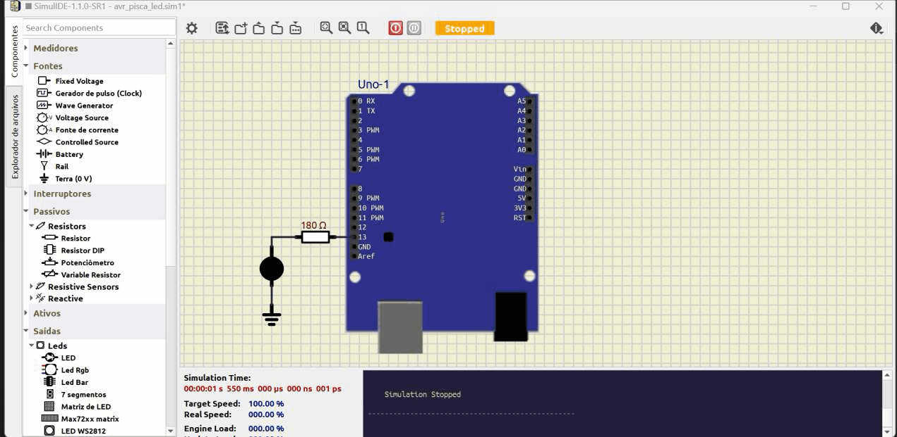

# AVR Pisca LED


O primeiro programa para dispositivos embarcados, costuma ser um programa para piscar um LED, que server para testar as ferramentas de compilação e gravação, verificando sua integridade e capacidade de execução.

Este projeto contém um programa mínimo para piscar um LED na plataforma Arduino Uno, porém o seu desenvolvimento se dá com a utilização e programação do microcontrolador de forma direta, sem a utilização do que chamamos *framework* Arduino.


| Componente            | Modelo                                                                                                                               | Descrição                                                                                                                                     |
| :-------------------- | :----------------------------------------------------------------------------------------------------------------------------------- | :-------------------------------------------------------------------------------------------------------------------------------------------- |
| Microcontrolador      | [AVR - ATMega328P](https://ww1.microchip.com/downloads/en/DeviceDoc/Atmel-7810-Automotive-Microcontrollers-ATmega328P_Datasheet.pdf) | Plataforma Arduino Uno como interface                                                                                                         |
| IDE                   | [MPLabX](https://www.microchip.com/en-us/tools-resources/develop/mplab-x-ide)                                                        | Ambiente de Desenvolvimento Integrado - [Instalação](https://developerhelp.microchip.com/xwiki/bin/view/software-tools/ides/x/install-guide/) |
| Compilador            | [XC8](https://www.microchip.com/en-us/tools-resources/develop/mplab-xc-compilers/xc8)                                                | [Instalação](https://developerhelp.microchip.com/xwiki/bin/view/software-tools/xc8/install/)                                                  |
| Editor de código      | [Notepad++](https://notepad-plus-plus.org/downloads/)                                                                                | [v8.7.7](https://github.com/notepad-plus-plus/notepad-plus-plus/releases/download/v8.7.7/npp.8.7.7.Installer.x64.exe)                         |
| Construtor de projeto | [Makefile](https://stackoverflow.com/questions/32127524/how-to-install-and-use-make-in-windows)                                      | Power Shell<br>`winget install Chocolatey.Chocolatey`<br>`choco install make`                                                                 |
| Gravador do AVR       | [AVRDudess](https://github.com/ZakKemble/AVRDUDESS/releases/tag/v2.18)                                                               | [ZakKemble/AVRDUDESS/v2.18](https://github.com/ZakKemble/AVRDUDESS/releases/download/v2.18/AVRDUDESS-2.18-setup.exe)                          |
| Simulador eletrônico  | [SimulIDE](https://simulide.com/p/downloads/)                                                                                        | Power Shell<br>`winget install SimulIDE.SimulIDE`                                                                                             |
| Versionamento         | [git](https://git-scm.com/downloads)                                                                                                 | Power Shell<br>`winget install --id Git.Git -e --source winget`                                                                               |


Para testar a integridade das ferramentas de desenvolvimento aqui utilizadas, no seu computador, siga os passos: 


| Figura 1: Baixar o projeto do servidor git (Codeberg ou Github); |
|:----------------------------------------------------------------:|
|                                    |
| Fonte: Autor  										           |

No terminal (Windows Power Shell), crie um diretório para armazenar os projetos:
```barra
mkdir projetos
```
Acesso o diretório criado: 
```bash
cd projetos
```
Clone o projeto de teste:
```bash
git clone https://github.com/JoseWRPereira/avr_pisca_led.git

ou

git clone https://codeberg.org/JoseWRPereira/avr_pisca_led.git
```

Acesse o diretório do projeto baixado: 
```bash
cd avr_pisca_led
```

Executando o comando: 
```bash
make notepad
```
é possível abrir o **notepad++** com os arquivos *.c* e *.h* que houverem no diretório corrente.
Vá em `Arquivo`, `Abrir...` e abra o arquivo `makefile.mak`. 
Verifique o local e a versão do compilador conforme ilustrado na Figura 2.

| Figura 2: Verificar o local de instalação e a versão do compilador (XC8); |
|:-------------------------------------------------------------------------:|
|                                               |
|                                                                           |
|                                               |
| Fonte: Autor  		        								            |


Conecte o Arduino ao conector USB e verifique qual foi a porta alocada para ele. 
Se necessário ajuste na linha 1 do `makefile.mak`.


| 3. Conectar e verificar a porta de comunicação com o Arduino Uno (Com5 no meu caso de exemplo); |
|:-------------------------------------------------------------------------:|
|                                                      |
| Fonte: Autor  		        								            |


Se todos os programas estiverem instalados e nos locais apontados no `makefile.mak`, 
basta executar:
```bash
make
```
para compilar o projeto e:

```bash
make flash
```
para fazer o a gravação do binário no microcontrolador(ATmega328P) do Arduino. 


| 4. Testar a compilação e a gravação do projeto;                           |
|:-------------------------------------------------------------------------:|
|  |
| Fonte: Autor  		        								            |


| 5. Testar a simulação utilizando o software SimulIDE; |
|:-----------------------------------------------------:|
|              |
| Fonte: Autor  		        						|


| 6. Simulação de Pisca LED                             |
|:-----------------------------------------------------:|
|                         |
| Fonte: Autor  		        						|


